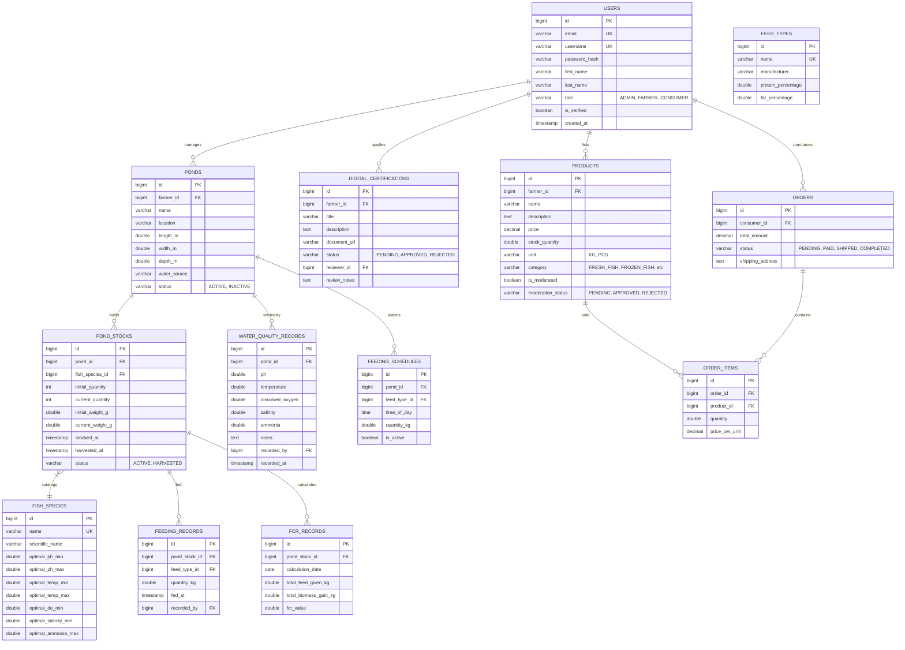

# Smart Fisheries System - Architecture & Project Specification

This document contains the complete high-level architecture, database entity relationship diagram (ERD), folder layouts, REST API specifications, future integration contracts, development roadmaps, and MVP scope for the **Smart Fisheries System** (e-fish).

---

## 1. High-Level Architecture Diagram

The system follows **Clean Architecture** principles layered on a standard Spring Boot and React Vite web application stack. It is designed with modular layers to decouple core business logic from database frameworks, presentation platforms, and future IoT/AI engines.

```mermaid
graph TD
    subgraph Client Application (Frontend)
        React[React 19 + TypeScript] --> Zustand[Zustand Stores]
        React --> Router[React Router]
        React --> Recharts[Recharts Graphs]
        React --> Axios[Axios API Client]
    end

    subgraph Spring Boot Backend (REST API)
        Axios --> Controller[Controllers / REST Endpoints]
        Controller --> Security[Spring Security + JWT Authentication]
        Controller --> Service[Service Layer - Business Logic]
        Service --> Mapper[MapStruct Mappers & DTOs]
        Service --> Repository[Spring Data JPA Repositories]
        Repository --> DB[(PostgreSQL Database)]
        Flyway[Flyway Migrations] --> DB
    end

    subgraph Future Extensions (IoT & AI Nodes)
        MQTTBroker[MQTT Broker / Eclipse Mosquitto] -.->|Telemetry| IoTService[MQTT Integration Service]
        IoTService -.-> Service
        ESP32[ESP32 / Water Sensors] -.->|Publish pH, DO, Temp| MQTTBroker
        
        Service -.->|REST API / WebClient| AIService[AI Prediction Service / Python FastAPI]
        AIService -.->|Harvest Prediction & CV Biomass| Service
    end
```

---

## 2. Database Entity Relationship Diagram (ERD)

The database schema utilizes standard indexing, foreign keys, and cascading rules to maintain data integrity.



---

## 3. Directory Layouts

### Backend Structure (Maven Multi-Layered packages)
```
backend/
├── pom.xml
└── src/
    ├── main/
    │   ├── java/com/smartfisheries/
    │   │   ├── SmartFisheriesApplication.java
    │   │   ├── config/             # Security, CORS, Swagger OpenAPI config
    │   │   ├── controller/         # RestControllers (Admin, Farmer, Consumer, Auth)
    │   │   ├── dto/                # Request & Response records (Jakarta Validated)
    │   │   ├── entity/             # JPA Entity definitions & Role Enums
    │   │   ├── exception/          # GlobalExceptionHandler & custom response structures
    │   │   ├── mapper/             # MapStruct interfaces translating entities to DTOs
    │   │   ├── repository/         # JpaRepository interfaces
    │   │   ├── security/           # CustomUserDetails, JWT Service filters
    │   │   └── service/            # Business layer (FCR math, Water warnings, Checkout transactions)
    │   └── resources/
    │       ├── application.yml
    │       └── db/migration/       # Flyway SQL migrations (V1 Init, V2 Seed data)
    └── test/                       # Integration test files
```

### Frontend Structure (Vite React TypeScript)
```
frontend/
├── package.json
├── vite.config.ts
├── tailwind.config.js
├── postcss.config.js
└── src/
    ├── main.tsx
    ├── App.tsx
    ├── index.css
    ├── layouts/
    │   └── DashboardLayout.tsx     # Responsive Sidebar navigation (RBAC routing)
    ├── store/
    │   ├── authStore.ts            # Zustand JWT auth persistence
    │   └── cartStore.ts            # Zustand shopping cart state
    ├── services/
    │   └── api.ts                  # Axios client query endpoints
    ├── types/
    │   └── index.ts                # TypeScript declarations for database entities
    └── pages/
        ├── LoginPage.tsx
        ├── RegisterPage.tsx
        ├── FarmerDashboard.tsx     # Active ponds, warning alerts list
        ├── PondsPage.tsx           # CRUD ponds, stock release and harvesting
        ├── WaterQualityPage.tsx    # Manual parameter inputs, Recharts trend lines
        ├── FeedingPage.tsx         # Feeding session logging & timer calendars
        ├── FcrAnalyticsPage.tsx    # FCR reports, fish weight sample logs
        ├── FarmerCatalogPage.tsx   # CRUD shop products & moderation status
        ├── CertificationsPage.tsx  # Document upload submissions
        ├── ConsumerMarketplace.tsx # Browse catalogs, search & filter items
        ├── CartPage.tsx            # Checkout form & shipping details
        ├── ConsumerOrders.tsx      # Purchase order tracking statuses
        └── AdminDashboard.tsx      # Verification approvals & user grids
```

---

## 4. Endpoints API Specifications

| Method | Endpoint | Request Body | Response Body | Roles | Description |
| :--- | :--- | :--- | :--- | :--- | :--- |
| **POST** | `/api/auth/register` | `RegisterRequest` | `AuthResponse` | `permitAll` | Create user profile |
| **POST** | `/api/auth/login` | `LoginRequest` | `AuthResponse` | `permitAll` | Authenticate & exchange JWTs |
| **POST** | `/api/auth/refresh` | `RefreshTokenRequest` | `AuthResponse` | `permitAll` | Refresh token request |
| **POST** | `/api/auth/change-password`| `ChangePasswordRequest`| `String` | `authenticated`| Password revisions |
| **POST** | `/api/farmer/ponds` | `PondRequest` | `PondResponse` | `FARMER, ADMIN`| Register new pond asset |
| **GET** | `/api/farmer/ponds` | - | `List<PondResponse>` | `FARMER, ADMIN`| Get farmer's ponds list |
| **POST** | `/api/farmer/ponds/{id}/stock`| `PondStockRequest` | `PondStockResponse`| `FARMER, ADMIN`| Add new crop batch to pond |
| **PUT** | `/api/farmer/ponds/{id}/stock/{sId}/harvest`| - | `PondStockResponse`| `FARMER, ADMIN`| Finalize harvesting batch |
| **PUT** | `/api/farmer/stock/{sId}/weight`| `weightG, quantity` params| `PondStockResponse`| `FARMER, ADMIN`| Log fish weight samples |
| **POST** | `/api/farmer/ponds/{id}/water-quality`| `WaterQualityRequest`| `WaterQualityResponse`| `FARMER, ADMIN`| Record parameters & check alerts |
| **GET** | `/api/farmer/ponds/{id}/water-quality/latest`| - | `WaterQualityResponse`| `FARMER, ADMIN`| Read current indicator panel |
| **GET** | `/api/farmer/ponds/{id}/water-quality/history`| `days` param | `List<WaterQualityResponse>`| `FARMER, ADMIN`| Fetch values for Recharts |
| **POST** | `/api/farmer/stock/{sId}/feeding`| `FeedingRecordRequest`| `FeedingRecordResponse`| `FARMER, ADMIN`| Log feed input & trigger FCR update|
| **GET** | `/api/farmer/stock/{sId}/feeding`| - | `List<FeedingRecordResponse>`| `FARMER, ADMIN`| Fetch feeding session logs |
| **POST** | `/api/farmer/ponds/{id}/feeding-schedules`| `FeedingScheduleRequest`| `FeedingScheduleResponse`| `FARMER, ADMIN`| Set up daily schedule |
| **GET** | `/api/farmer/stock/{sId}/fcr/report`| - | `FcrReportResponse`| `FARMER, ADMIN`| Read current calculated FCR |
| **GET** | `/api/farmer/stock/{sId}/fcr/history`| - | `List<FcrRecordResponse>`| `FARMER, ADMIN`| FCR trend line data |
| **POST** | `/api/farmer/certifications`| `CertificationRequest`| `CertificationResponse`| `FARMER` | Apply certification documents |
| **GET** | `/api/admin/certifications/pending`| - | `List<CertificationResponse>`| `ADMIN` | Retrieve verification queue |
| **PUT** | `/api/admin/certifications/{cId}/review`| `ReviewCertificationRequest`| `CertificationResponse`| `ADMIN` | Approve/Reject & toggle verify status|
| **GET** | `/api/auth/marketplace/products`| `query, category` params| `List<ProductResponse>`| `permitAll` | Search marketplace catalog |
| **POST** | `/api/farmer/products` | `ProductRequest` | `ProductResponse` | `FARMER` | List product for sale |
| **PUT** | `/api/admin/products/{pId}/moderate`| `status` param | `ProductResponse` | `ADMIN` | Moderate item (Approve/Reject) |
| **POST** | `/api/consumer/orders` | `OrderRequest` | `OrderResponse` | `CONSUMER` | Submit cart checkout order |
| **GET** | `/api/consumer/orders` | - | `List<OrderResponse>`| `CONSUMER` | Purchase order tracking |
| **PUT** | `/api/farmer/orders/{oId}/status`| `status` param | `OrderResponse` | `FARMER, ADMIN`| Revise order shipment status |

---

## 5. Future Integration Contracts (IoT & AI Architecture Readiness)

Although hardware and computer vision predictions are excluded in the MVP, the architecture is ready to accept integrations using the following contracts:

### A. IoT Sensor Integration (MQTT Broker Contract)
* **Broker Protocol**: MQTT v5 / TCP
* **MQTT Topics**:
  * Telemetry Stream: `telemetry/farmer/{farmerId}/pond/{pondId}`
  * Remote Configuration: `command/farmer/{farmerId}/pond/{pondId}`
* **Payload Structure (JSON)**:
```json
{
  "device_id": "ESP32-POND-A-098",
  "recorded_at": "2026-06-13T22:30:15Z",
  "sensors": {
    "ph": 7.42,
    "temperature": 28.3,
    "dissolved_oxygen": 5.4,
    "salinity": 1.2,
    "ammonia": 0.012
  }
}
```
* **Backend Hook**: Spring Integration MQTT Adapter intercepts incoming payloads on the topic, verifies bounds using the established `WaterQualityService.java`, and publishes `Notification` models if triggers are tripped.

### B. AI Prediction Service (REST / WebClient Contract)
* **Provider**: Python FastAPI Server running predictive models (Random Forest / Deep Learning).
* **Endpoint Call**: `POST http://ai-engine-service/api/predictions/fcr-forecast`
* **Request JSON**:
```json
{
  "pond_stock_id": 1,
  "fish_species": "Nila (Tilapia)",
  "historical_fcr": [1.28, 1.26, 1.25],
  "water_telemetry_average_7d": {
    "ph": 7.2,
    "temperature": 28.5,
    "dissolved_oxygen": 5.1,
    "ammonia": 0.015
  },
  "target_days": 15
}
```
* **Response JSON**:
```json
{
  "predicted_fcr": 1.23,
  "confidence_level": 0.94,
  "recommended_feed_quantity_kg": 14.5,
  "harvest_ready_probability": 0.87
}
```

---

## 6. Sprints & Development Roadmap

```
Phase 1: Foundation (Sprint 1)  ===>  Phase 2: Management (Sprint 2)  ===>  Phase 3: Marketplace & AI-Ready (Sprint 3)
   - DB Schema & Flyway            - Pond & Stock CRUD              - Shop Listings & Moderations
   - Security Security & JWTs      - Water telemetry & warning logs - Shopping cart & checkout orders
   - Frontend setup & Nav Layout   - Feedings & FCR calculations    - Analytics & Documentation
```

### Sprint 1: Security & Core Infrastructure (Weeks 1-2)
* Setup PostgreSQL DB, H2 test profiles, and write Flyway migration schema (`V1`, `V2`).
* Build Backend JWT filter mechanism, register & login services.
* Scaffold Frontend React Vite + Tailwind CSS layout directories.
* Implement custom state management using Zustand for Auth configurations.
* Implement Routing protection rules and Dashboard layouts.

### Sprint 2: Pond Cultivation Telemetry & Analytics (Weeks 3-4)
* Build Pond asset registers and stocking batch triggers.
* Implement Water quality log inputs and automated warning alerts based on fish species parameters.
* Implement Feed type catalogs, log feedings, and schedule alarm schedules.
* Develop automatic FCR equation calculators triggered on feed/weight updates.
* Develop Recharts time-series dashboards.

### Sprint 3: Marketplace & Admin Dashboards (Weeks 5-6)
* Create marketplace product listings (image galleries, categorical filters, search features).
* Implement admin moderation queues for certification submissions and product postings.
* Build consumer checkout shopping carts, order tracking, and stock deductions.
* Package OpenAPI Swagger specifications and prepare IoT integration contracts.

---

## 7. MVP Scope Definitions

* **In Scope**:
  1. Complete User RBAC registers (Admin, Farmer, Consumer).
  2. Pond CRUD operations and stocking history.
  3. Manual physical-chemical water telemetry logs (pH, temp, DO, salinity, ammonia).
  4. Automatic warning notification system triggered on telemetry logs.
  5. Feed calendars, schedules, and log feedings.
  6. Mathematical FCR calculators and charts.
  7. Digital certificate submissions (Farmer) and reviews (Admin).
  8. Marketplace product listings, search queries, cart checkouts, and status tracking.
  9. OpenAPI Swagger schemas and unit testing.

* **Out of Scope (Post-MVP integrations)**:
  1. ESP32 hardware MQTT listeners (stubbed via IoT contracts).
  2. AI harvest projection models and Computer Vision scanners (stubbed via AI contracts).
  3. Real-time Payment Gateway integration (COD is utilized).
